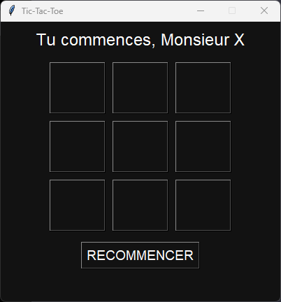

# Tic-Tac-Toe avec Tkinter

Un simple jeu utilisant la bibliothèque Tkinter pour l'interface graphique.

## Fonctionnalités

- Interface graphique conviviale avec des boutons pour chaque case du plateau.
- Affichage des messages du jeu, indiquant le joueur actuel et le résultat de la partie.
- Possibilité de recommencer une nouvelle partie.
- Mise en valeur visuelle des lignes gagnantes et des matchs nuls.

## Capture d'écran

Amusez-vous bien à jouer au Morpion!
